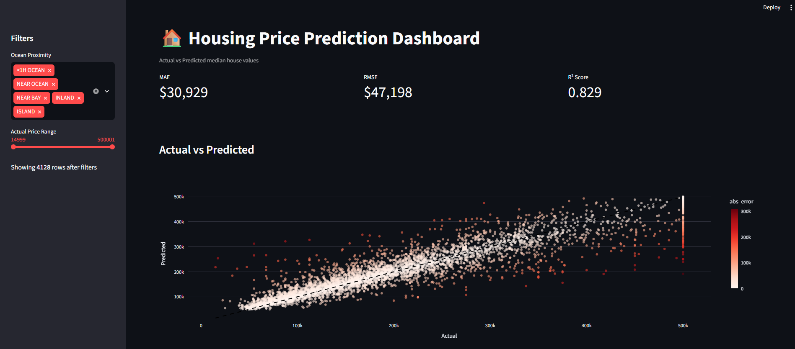

# California Housing Price Prediction

A small ML project to predict median house values in California using the classic housing dataset. Trains a Random Forest model and includes a Streamlit dashboard to visualize how well the predictions hold up.

## What's in here

- `main.py` — trains the model (first run) or does inference on new data (subsequent runs)
- `dashboard.py` — Streamlit dashboard to compare actual vs predicted values
- `housing.csv` — the dataset

## How to run

```bash
python -m venv venv
venv\Scripts\activate
pip install -r requirements.txt

python main.py          # train + generate predictions
streamlit run dashboard.py   # view the dashboard
```

## Results



- MAE: ~$30,900
- RMSE: ~$47,200
- R²: 0.83

## Notes

Just a personal learning project — playing around with sklearn pipelines and Streamlit dashboards.